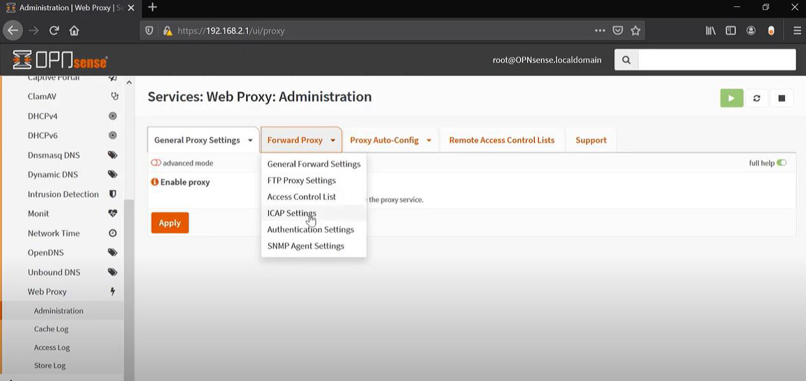

# Enterprise Security Enhancement: Next-Gen Firewall, Web Proxy, Antivirus, IDS/IPS, and Sensei Implementation

**Introduction**

As part of a contract with Banana Corp, a startup facing cybersecurity
challenges, I've been tasked with implementing a comprehensive security
solution. Following a recent cyber attack experienced by their CTO,
Steve Bobs, my role involves setting up a Next Generation Firewall to
fortify their enterprise. This document outlines the specific
requirements and steps to enhance the security posture of Banana Corp's
environment.

**Requirements:**

As part of the project, the initial setup involves configuring the
network infrastructure with specific requirements:

1.  Establishment of a WAN with a subnet address of 172.16.10.0/24 and
    DHCP enabled.

2.  Implementation of 2 Host-only networks for LANs.

3.  Installation of Opnsense on the Firewall VM and Windows 10 on both
    Admin and Billy’s PCs.

4.  Configuration of the first LAN on the Firewall console with a
    gateway IP address of 10.10.\[5\].254, designated as the Admin
    Network.

5.  Configuration of the second LAN on the Firewall console with a
    gateway IP address of 10.10.13.254, designated as the Sales Network.

6.  On the first Windows 10 machine, renaming the host to \[Solomon
    Admin\].

7.  Setting the \[Solomon Admin\] PC with a static IP of 10.10.\[05\].2.

8.  On the second Windows 10 machine, renaming the host to Billy (DHCP
    to be enabled later in Firewall).

Accordingly, I spearheaded the establishment of a robust cybersecurity
infrastructure for Banana Corp, systematically deploying an
OPNsense-based Next Generation Firewall. I started by creating the
virtual lab environment according to the specified requirements. This
involved configuring the WAN with a subnet address, setting up host-only
networks, installing OPNsense on the firewall VM, and configuring the IP
addresses and hostnames for both Windows 10 machines.

This comprehensive report details each step of the implementation
process, supported by an array of screenshots for a transparent
illustration.

**Part 1: Set up the Network Topology**

The following Screenshots were captured to validate the correct
implementation comprising of topology configuration, OPNsense console
settings, IP configuration on the Admin Windows machine as well as
Hostname configuration on both Windows machines.

**Figure 1. An Interface showing the WAN configuration with a subnet
address of 172.16.10.0/24 and DHCP turned ON**

**Figure 2. An Interface showing the LAN configuration for the second
LAN (Sales Network) with a subnet address of 10.10.13.254/24**

**Figure 3. An Interface showing the Sales Network (in this case the
GuestNetwork with interface name em2) finalized configuration of its ip
address**

**Figure 4. An Interface showing the LAN configuration for the First LAN
(Admin Network) with a subnet address of 10.10.5.254/24**

**Figure 5. An Interface showing the final configuration of the ip
address for Admin Network (in this case the LAN with interface name
em1)**

**Figure 6. changing the host name to \[Studentname Admin\], in this
case Solomon Admin, on the first Windows 10 machine**

**Figure 7. An interface showing the newly-assigned ip address of the
first LAN (Admin PC) on the command prompt**

**Figure 8. changing the host name to Billy on the Second Windows 10
machine**

**Figure 9. Accessing the OPNsense web interface with the newly-obtained
ip address of 10.10.5.254**

**Figure 10. An Interface showing OPNsense firewall setup configuring
the ip address for Admin Network (in this case the LAN with interface
name em1), which is 10.10.5.254**

**Figure 11. An Interface showing OPNsense firewall setup configuring
the ip address for Sales Network (in this case, the GuestNetwork with
interface name em2), which is 10.10.13.254**

**Part 2: Basic Server Setup and Installation**

As part of the project's second phase, I successfully completed the
fundamental setup and installation of servers, addressing the following
key requirements:

1.  **User Accounts Setup:**

- **Action:** Added specific users to the Firewall, including
  Student-Admin, Steve-Standard, Bob-Admin, and Xena-Standard.

- **Rationale:** This step ensures distinct user roles for efficient
  firewall management.

2.  **Password Security Implementation:**

- **Action:** Ensured the firewall employs a secure password with a
  length of 8 characters, including special characters, uppercase
  letters, and numbers.

- **Rationale:** Enhances the security posture of the firewall, adhering
  to industry best practices.

3.  **Applications Installation and Configuration:**

- **Action:** Updated the firewall to ensure it is current.

- **Action:** Installed essential applications, including configuring
  the firewall as the NTP server for the enterprise. The Stratum 0
  configuration utilized the NIST NTP Server.

- **Action:** Configured the firewall as the DHCP server for all LAN
  networks, with reserved IP address blocks 1-10 for enterprise devices
  on the LAN.

- **Rationale:** These actions facilitate optimal network time
  synchronization, DHCP service provision, and reserved IP address
  management.

4.  **Dashboard Structuring:**

- **Action:** Organized the dashboard into four columns, structuring
  them based on functionality widgets.

- **Widgets Included:** Network time, gateways, interfaces, interface
  statistics, traffic graph, firewall logs, system logs, services, and
  CPU usage.

- **Rationale:** The structured dashboard enhances monitoring
  capabilities, providing a comprehensive overview of essential network
  metrics.

Additionally, I undertook the following tasks based on the specified
requirements:

- **Firewall Hostname and Domain Configuration:**

  - Set the Firewall hostname to \[studentinitial.opnsense\].

  - Configured the domain to Banana.corp.

<!-- -->

- **Additional Software Installation:**

  - Installed necessary applications: upnp, Frr, LLDpD.

- **Logging and Activity Configuration:**

  - Configured the firewall to log all activities locally.

    - Set the log file size to 512mb.

    - Ensured logging of packets matched from the default block rules.

<!-- -->

- **LLDpD Configuration:**

  - Configured LLDpD to meet the Cisco-exclusive environment
    requirements.

    - Ensured CDP (Cisco Discovery Protocol) is enabled.

- **Routing Configuration:**

  - Ensured all LANs have access to the WAN.

  - Labeled all interfaces according to industry standards.

Screenshots were taken to validate the successful execution of these
tasks, including:

- Confirmation of the correct Firewall name (\[Studentinitials
  Opnsense\]).

- Proof of plugin installations.

- Dashboard, logging, NTP, LLDpD/routing configurations.

- Verification of NTP and DHCP services running.

- Active DHCP with required static reservations on the Admin Network.

This meticulous execution ensures compliance with the outlined
requirements, providing a secure and well-configured environment for
Banana Corp.

The following Screenshots were taken to demonstrate the accuracy of the
configurations.

**Figure 12. OPNsense interface to add new users with Access
Privileges**

**Figure 13. Adding “Student” user to the Firewall with Admin Access
Privilege**

**Figure 14. Adding “Bob” user to the Firewall with Admin Access
Privilege**

**Figure 15. Adding “Xena” user to the Firewall with Admin Access
Privilege**

**Figure 16. Adding “Steve” to the Firewall with Standard Access
Privilege**

**Figure 17. The final interface showing all the users created on the
firewall with their access privileges**

**Figure 18. Configuring the firewall to be the NTP server for the
Enterprise**

**Figure 19. Configuring the firewall to be the DHCP server for all LAN
Networks**

**Figure 20. Configuring the Dashboard to have 4 columns organize the
columns based on functionality widgets**

**Figure 21. Setting Firewall hostname to \[studentinitial.opnsense\],
in this case Solomon.OPNsense and the Domain to Banana.corp**

**Figure 22. The Interface showing after Setting the Firewall hostname
and Domain**

**Figure 23. The Interface showing after installing the os-upnp plugin
on the firewall**

**Figure 24. The Interface showing after installing the os-frr plugin on
the firewall**

**Figure 25. The Interface showing after installing the os-lldpd plugin
on the firewall**

**Figure 26. Configuring the firewall to log every activity locally**

**Figure 27. Configuring LLDpd plugin service to Enable CDP service so
that it will activate the Cisco Discovery Protocol**

**Figure 28. Configuring the LAN interface to make sure the "Block
private networks and loopback addresses" option is not checked to allow
LANs access to the WAN**

**Figure 29. Ensuring that all interfaces are labeled according to
industry standards**

**Part 3: Firewall Configuration**

As part of the third phase dedicated to Firewall Configuration, I
executed the following actions to meet the specified requirements:

1.  **Internet Access for Sales Network:**

- Configured the firewall to enable internet access for the Sales
  Network.

<!-- -->

- Verified functionality with screenshots demonstrating successful
  internet access on the Sales Network machine.

2.  **Ping Accessibility:**

- Enabled the Admin to ping into the Sales Network.

- Demonstrated the successful execution through screenshots showcasing
  the ping from the Admin to Sales Network.

3.  **Restrictions on SSH and Telnet:**

- Implemented restrictions to prevent the Sales Network from SSH and
  Telnet access into the firewall.

<!-- -->

- Validated the effectiveness of restrictions with screenshots
  displaying unsuccessful attempts using Putty.

These actions were meticulously executed, with accompanying screenshots
providing tangible evidence of the firewall configurations. This ensures
the fulfillment of the specified requirements, contributing to a secure
and controlled networking environment.

The following Screenshots were taken to demonstrate the accuracy of the
configurations.

**Figure 30. An Interface showing that the Sales Network could able to
access the Internet**

**Figure 31. An Interface showing that the Admin PC could able to ping
the Sales Network**

**Figure 32. An interface showing the Sales Network could ping the Admin
before configuring it to block ICMP request**

**Figure 33. An interface showing the Sales Network unable to ping the
Admin Network after configuring it to block ICMP request to Admin**

**Part 4: Web Proxy**

As part of the Web Proxy setup in the project's fourth phase, I
performed the following actions to enforce the enterprise's policy on
internet usage:

**Web Proxy Configuration**:

- Configured the web proxy to restrict access to specific websites,
  including Youtube, Facebook, Worldstarhiphop, Netflix, and Reddit.

- Verified the successful configuration through screenshots illustrating
  the web proxy setup.

**Website Blocking**:

- Implemented and validated the blocking of targeted websites to align
  with the enterprise's policy.

- Provided screenshots showcasing the successful prevention of access to
  restricted sites.

By diligently executing these tasks, I contributed to fostering a secure
and focused work environment in accordance with the enterprise's
internet usage guidelines.

The following Screenshots were taken to demonstrate the accuracy of the
configurations.

**Figure 34. Configuring Web Proxy to block Websites**

**Figure 35. Configuring the firewall to block Youtube, Facebook,
Worldstarhiphop, Netflix, and Reddit sites**

**Figure 36. An interface showing netflix being successfully blocked**

**Figure 37. An interface showing woldstarhiphop being successfully
blocked**

**Figure 38. An interface showing facebook being successfully blocked**

**Figure 39. An interface showing Reddit being successfully blocked**

**Part 5: Anti-Virus**

As part of the Antivirus implementation in the project's fifth phase, I
undertook the necessary actions to fortify the enterprise's network
against malware threats:

**Antivirus Software Installation:**

- Installed c-icap and ClamAV as the designated network antivirus
  software to prevent malware infiltration.

- Verified the successful setup through screenshots showcasing the
  installation and configuration of C-icap and ClamAV.

**Malware Blocking and Testing:**

- Configured ClamAV to actively block malware and virus downloads,
  ensuring robust protection.

- Utilized the test tool eicar.org to validate ClamAV's functionality,
  providing screenshots that demonstrate successful blocking and logging
  of potential incidents.

By implementing these measures, I enhanced the enterprise's
cybersecurity posture, proactively guarding against potential malware
threats.

The following Screenshots were taken to demonstrate the accuracy of the
configurations.

**Figure 40. An interface showing the completion of os-c-icap
installation**

**Figure 41. An interface showing the completion of os-clamav
installation**

**Figure 42. Configuring ClamAV by enabling it for Antivirus
Capability**

**Figure 43. Checking that Clamd (ClamAV Daemon) is enabled by going
into the Dashboard**

**Figure 44. Configuring the Forward Proxy setting to enable ICAP
setting**

**Figure 45. Enabling ICAP server as part of Web Proxy to filter or
replace content**

**Figure 46. Enabling c-icap service to provide content filtering and
inspection capabilities**

**Figure 47. Enabling the Antivirus ClamAV for malware detection and
prevention**

**Figure 48. Enabled services of C-ICAP server and ClamAV Daemon on the
OPNsense firewall dashboard**

**Figure 49. A Demonstration that our OPNsense ClamAV configuration is
working**

**Part 6: IDS/IPS**

As part of the project's sixth phase involving the implementation of
IDS/IPS, I executed the following steps to fortify the enterprise's
network against potential intrusions:

**Intrusion Prevention System (IPS) Setup:**

- Successfully configured Suricata IPS on the Admin network to actively
  prevent and record unauthorized scans.

- Provided screenshots illustrating the setup and configuration of
  Suricata for enhanced security.

**Scanning Prevention and Verification:**

- Implemented measures to block and log scans on the Admin network,
  ensuring robust protection against intrusion attempts.

- Installed nmap on Billy's client PC, ran scans on the Admin network,
  and presented screenshots showcasing the successful blocking and
  logging of these attempts.

By executing these actions, I bolstered the enterprise's network
security, actively thwarting potential intrusion activities and ensuring
a resilient defense against unauthorized access.

The following Screenshots were taken to demonstrate the accuracy of the
configurations.

**Figure 50. An Interface showing IDS Configuration**

**Figure 51. An Interface showing the Downloading and Installation of
our Suricata Package**

**Figure 52. Intrusion Detection Rules Specified under several
parameters including the rules specified under nmap**

**Figure 53. Searching, obtaining and editing the rule specified by
\#2024364 (ET SCAN Possible Nmap User-Agent Observed) to Drop it instead
of Alert**

**Figure 54. Creating the rule to block scanning**

**Figure 55. Running the nmap from Billy machine but the Admin machine
is in ignored states and there was no response, and this showing that
the attack is successfully blocked.**

**Part 7: Sensei**

As part of the project's seventh phase, focusing on the deployment of
Sensei on the Sales Network, I executed the following tasks to meet the
specified requirements:

Sensei Configuration:

- Successfully configured Sensei on the Sales Network to fulfill the
  blocking criteria for Bittorrent and Utorrent.

- Accomplished the configuration of Sensei to effectively block unwanted
  ads, enhancing the enterprise's network security.

Ad Blocking Verification:

- Utilized [<u>www.space.com</u>](http://www.space.com/) to demonstrate
  the ad-blocking capabilities of Sensei.

- Provided screenshots depicting the successful blocking of Bittorrent,
  Utorrent, and ads on [<u>www.space.com</u>](http://www.space.com/),
  ensuring a visual representation of the achieved results.

Dashboard Modification:

- Modified the dashboard to include blocked ads, enhancing the
  enterprise's visibility into ad-related activities.

- Presented screenshots displaying the adjusted dashboard and session
  details, providing comprehensive insights into the Sensei-enabled
  security measures.

By completing these actions, I enhanced the Sales Network's security
posture, effectively preventing unwanted content and ensuring a robust
defense against potential threats.

The following Screenshots were taken to demonstrate the accuracy of the
configurations.

**Figure 56. Configure Sensei to block Bittorrent and Utorrent**

**Figure 57. Configure Sensei to block Ads**

**Figure 58. An Interface showing Sensei successfully blocked utorrent**

**Figure 59. An Interface showing Sensei successfully blocked
bittorrent**

**Figure 60. Demonstrating the interface of space.com before configuring
ad blocks**

**Figure 61. Demonstrating the interface of space.com after configuring
ad blocks**

**Figure 62. The dashboard showing all the sessions allowed and blocked
by Zenarmor (Sensei)**

 

 
